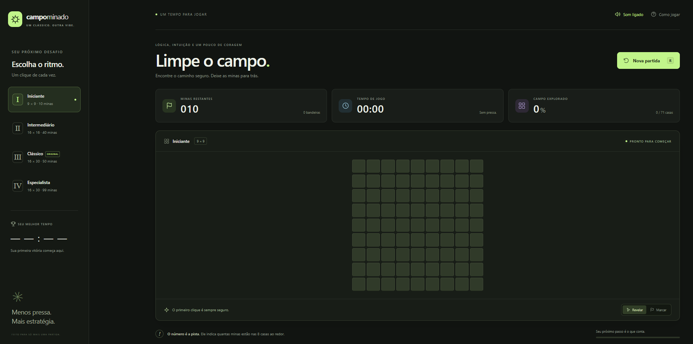
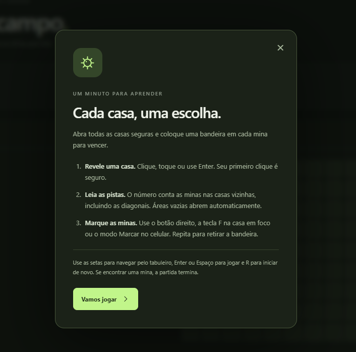
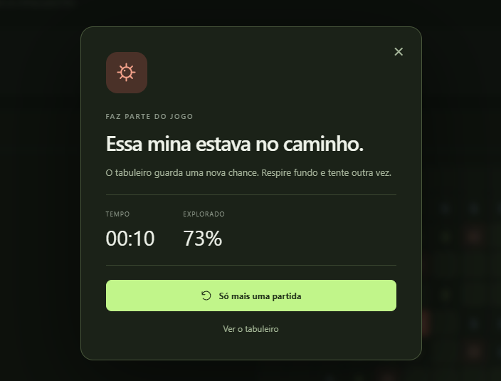
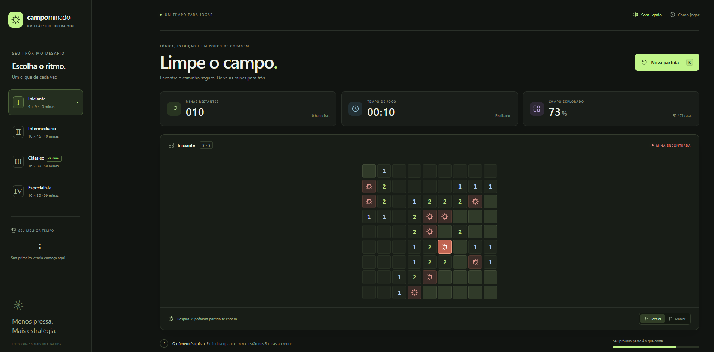

# Campo Minado

**Um clássico. Outra vibe.**

Campo Minado com interface web em tema escuro, quatro níveis de dificuldade e lógica de jogo em Java. Uma releitura do clássico com navegação por teclado, efeitos sonoros opcionais e acompanhamento do progresso da partida.



[Como executar](#como-executar) · [Como jogar](#como-jogar) · [Interface](#interface) · [Estrutura](#estrutura-do-projeto) · [Testes](#testes)

## Sobre o projeto

O projeto nasceu como uma aplicação Java Swing e evoluiu para uma experiência no navegador. O nome do repositório preserva essa origem; a versão atual utiliza HTML, CSS e JavaScript na interface, conectados a um servidor HTTP escrito em Java.

As regras, a distribuição das minas e o estado da partida ficam no servidor. O navegador apresenta o tabuleiro e envia as jogadas pela API, sem frameworks de frontend ou dependências externas para executar o jogo.

## Recursos

- **Quatro dificuldades:** do tabuleiro iniciante ao modo especialista, com 99 minas.
- **Primeiro clique seguro:** a primeira casa revelada nunca encerra a partida.
- **Abertura em cascata:** regiões vazias revelam automaticamente as casas vizinhas.
- **Indicadores de partida:** cronômetro, contador de bandeiras, minas restantes e percentual explorado.
- **Recordes por dificuldade:** o melhor tempo fica salvo no navegador via `localStorage`.
- **Mouse, teclado e toque:** modos Revelar e Marcar, além de atalhos para navegar e jogar.
- **Som opcional:** efeitos gerados pela Web Audio API, com preferência salva no navegador.
- **Interface responsiva:** tema escuro, instruções integradas e resumo ao encerrar a partida.

## Como executar

### Pré-requisitos

- JDK 17 ou superior, com `java` e `javac` disponíveis no terminal.
- Um navegador moderno.
- Git, caso utilize o comando de clonagem abaixo.

Não é necessário instalar Maven, Gradle ou pacotes npm para jogar.

### 1. Clone o repositório

```bash
git clone https://github.com/Pcthelab/CampoMinadoSwing.git
cd CampoMinadoSwing
```

### 2. Compile e inicie o servidor

Execute os comandos na raiz do projeto, tanto no PowerShell quanto em um terminal Linux ou macOS:

```bash
javac -encoding UTF-8 -d out src/modelo/*.java src/servidor/*.java src/visao/*.java
java -cp out visao.TelaPrincipal
```

### 3. Abra no navegador

Acesse **[http://127.0.0.1:8080](http://127.0.0.1:8080)**. Mantenha o terminal aberto enquanto joga e pressione `Ctrl+C` para encerrar o servidor.

Para usar outra porta:

```bash
java -cp out visao.TelaPrincipal 9090
```

Também é possível executar a classe `visao.TelaPrincipal` pela IDE. Configure o JDK e mantenha a raiz do projeto como diretório de trabalho, para que o servidor encontre a pasta `web`.

> A aplicação depende do servidor Java: abrir `web/index.html` diretamente não inicia o jogo. O servidor atende apenas em `127.0.0.1` e mantém uma partida em memória, compartilhada pelas abas que acessam a mesma instância. Reiniciar o processo descarta a partida; os recordes permanecem no navegador.

## Como jogar

Revele todas as casas seguras **e marque todas as minas com bandeiras** para vencer. Cada número indica quantas minas existem nas casas vizinhas, incluindo as diagonais. Depois da primeira abertura, revelar uma mina encerra a partida.

### Dificuldades

| Nível | Tabuleiro (linhas × colunas) | Minas |
| --- | --- | --- |
| Iniciante | 9 × 9 | 10 |
| Intermediário | 16 × 16 | 40 |
| Clássico | 16 × 30 | 50 |
| Especialista | 16 × 30 | 99 |

O modo **Clássico** preserva a configuração original do projeto e é o nível inicial do servidor.

### Controles

| Ação | Controle |
| --- | --- |
| Revelar uma casa | Clique ou toque no modo **Revelar** |
| Colocar ou remover uma bandeira | Botão direito ou clique/toque no modo **Marcar** |
| Navegar pelo tabuleiro | Teclas de seta |
| Ir ao início ou ao fim da linha | `Home` / `End` |
| Acionar a casa em foco no modo selecionado | `Enter` / `Espaço` |
| Marcar a casa em foco | `F` dentro do tabuleiro |
| Alternar entre Revelar e Marcar | `F` fora do tabuleiro |
| Solicitar uma nova partida | `R` |
| Abrir as instruções | `?` ou botão **Como jogar** |

## Interface

A paleta escura com detalhes em verde mantém o tabuleiro em destaque. Os indicadores mostram o andamento da partida, e o resultado reúne tempo e percentual explorado.

### Instruções e resultado

<table>
  <tr>
    <th>Como jogar</th>
    <th>Fim de partida</th>
  </tr>
  <tr>
    <td width="50%"></td>
    <td width="50%"></td>
  </tr>
</table>

### Tabuleiro após uma derrota

As minas são reveladas ao final da partida, com destaque para a casa que provocou a explosão. É possível fechar o resumo para observar o tabuleiro.



## Tecnologias e arquitetura

| Camada | Implementação |
| --- | --- |
| Regras do jogo | Java, com classes de domínio e observadores de eventos |
| Servidor local | `HttpServer` do JDK, com comunicação HTTP e JSON |
| Interface | HTML, CSS e JavaScript sem frameworks |
| Preferências e recordes | `localStorage` do navegador |
| Efeitos sonoros | Web Audio API |
| Testes | Java para o modelo e Node.js para integração HTTP |

O modelo controla abertura de casas, marcação, vizinhança, vitória e derrota. O servidor expõe essas operações pela API e entrega os arquivos da interface. O frontend renderiza o estado recebido e cuida da interação com o jogador.

## Estrutura do projeto

```text
CampoMinadoSwing/
├── docs/images/              Capturas de tela do README
├── src/
│   ├── modelo/               Regras, campos, tabuleiro e eventos
│   ├── servidor/
│   │   └── ServidorJogo.java  Servidor HTTP e API do jogo
│   └── visao/
│       └── TelaPrincipal.java Ponto de entrada da aplicação
├── test/
│   ├── modelo/               Testes de regressão do modelo
│   └── api.mjs               Testes de integração HTTP
├── web/
│   ├── index.html            Estrutura da interface
│   ├── style.css             Estilos e layout responsivo
│   ├── app.js                Interações e comunicação com a API
│   └── favicon.svg           Ícone da aplicação
└── README.md
```

## Testes

Compile a aplicação e os testes a partir da raiz do repositório:

```bash
javac -encoding UTF-8 -d out/test src/modelo/*.java src/servidor/*.java src/visao/*.java test/modelo/*.java
java -cp out/test modelo.TabuleiroTeste
```

Os testes do modelo verificam vizinhança, bandeiras, abertura em cascata, proteção do primeiro clique, vitória, derrota, reinício e parâmetros inválidos.

Para os testes de integração, utilize também **Node.js 18 ou superior**. Após a compilação acima, execute:

```bash
node test/api.mjs
```

A suíte inicia seu próprio servidor em uma porta disponível e o encerra ao terminar. Ela verifica os arquivos públicos, as dificuldades, as jogadas e as validações da API, sem instalar pacotes npm.

---

Desenvolvido por [Pcthelab](https://github.com/Pcthelab).
