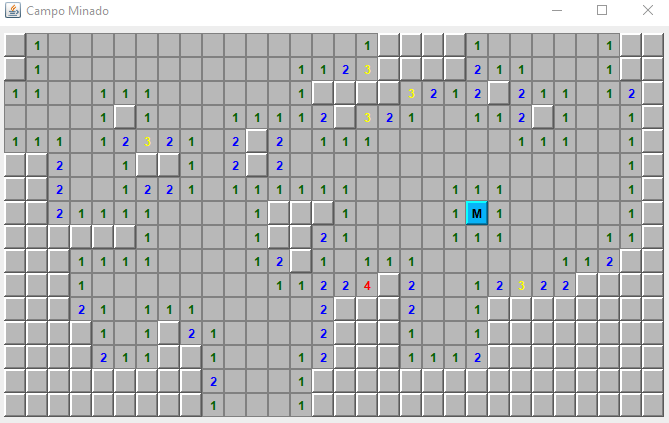
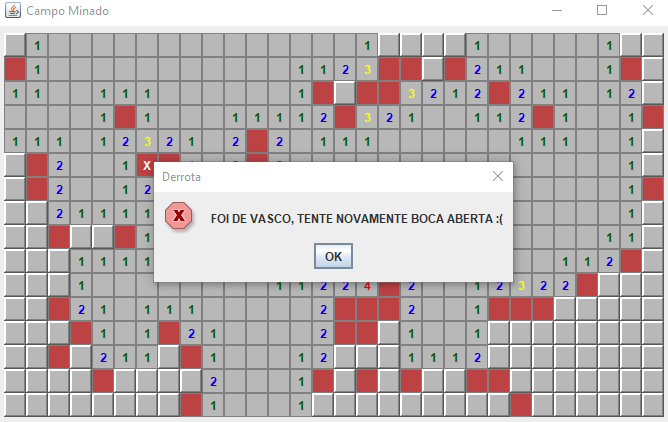
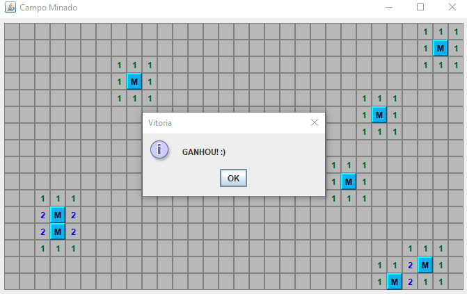

# Campo Minado — Java Swing

Implementação do clássico Campo Minado em Java 26, com interface gráfica em Swing. O projeto aplica o padrão Observer para conectar as regras do jogo aos componentes da tela.

## Funcionalidades

- Abertura de campos com o botão esquerdo do mouse.
- Marcação e remoção de bandeiras com o botão direito.
- Atualização da interface a cada alteração no tabuleiro.
- Telas de vitória e derrota, com mensagem personalizada ao encontrar uma mina.

## O jogo em ação

### Tabuleiro

Use os números dos campos abertos para identificar onde estão as minas e decidir seu próximo movimento.

### Tela de derrota

A partida termina quando uma mina é aberta.

### Tela de vitória

Ao resolver o tabuleiro, o jogo exibe a tela de vitória.

## Como jogar

| Controle | Ação |
| --- | --- |
| Clique esquerdo | Abrir um campo |
| Clique direito | Marcar ou desmarcar uma bandeira |

Cada número indica a quantidade de minas nos campos vizinhos. Use essas informações para encontrar os campos seguros e marcar os suspeitos.

O objetivo é revelar os campos seguros sem abrir uma mina.

## Tecnologias utilizadas

- **Java 26:** lógica e regras do jogo.
- **Java Swing:** interface gráfica e interação com o usuário.

## Conceitos aplicados

### Padrão Observer

Os componentes da interface observam as mudanças nos campos do tabuleiro. Quando um campo é aberto ou marcado, seus observadores são notificados e atualizam a representação visual.

Essa estrutura mantém as regras do jogo separadas do código responsável pela interface.

### Expressões lambda e Streams

Utilizadas para percorrer os campos do tabuleiro e filtrar seus vizinhos, simplificando operações sobre as coleções.

### Tratamento de eventos

Os eventos do mouse diferenciam os cliques esquerdo e direito e acionam as operações de abertura e marcação dos campos.

## Sobre o projeto

Projeto concluído como prática de desenvolvimento em Java, com foco em interfaces gráficas, tratamento de eventos e aplicação do padrão Observer.
